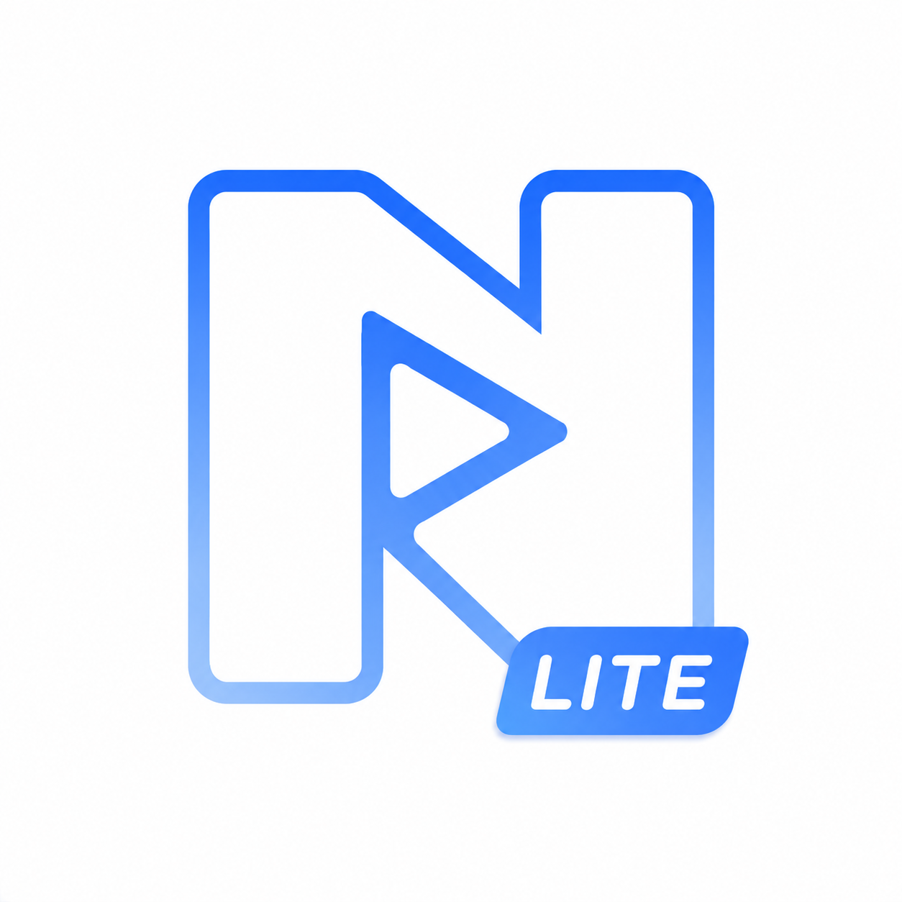

<div align="center">

# Nosved Player



# Nosved Player

### Video Player for Android

[](https://github.com/DevSon1024/Nosved-Player-Lite/releases/latest)
[](https://github.com/DevSon1024/Nosved-Player-Lite/releases)
[](LICENSE)
[](https://developer.android.com)
[-blue.svg>)](https://developer.android.com)

</div>

**Nosved Player** is a clean, modern, and high-performance local video player for Android. Built from the ground up using **Jetpack Compose** and **Media3 (ExoPlayer)**, it delivers a premium media experience with a focus on simplicity, fluidity, and Material You design.

> **⚠️ Migration Notice (v1.4.0+):** The application package name has migrated to `com.devson.nvplayerlite` to align with external app store releases. If you are updating from v1.3.0 or below, this will install as a fresh application.

---

> ## Screenshots

>> ### Home & Navigation

<div align="center">


</div>

>> ### Sort, View Settings & Rotary Wheel

<div align="center">


</div>

>> ### Settings & About

<div align="center">


</div>

>> ### Player - Default & Modern Style (Landscape)

<div align="center">


</div>

---

> ## Key Features

>> ### Playback & Dual Player UI

- **Default Style** - Clean, minimal controls with gesture-based brightness & volume adjustment.
- **Modern Style** - Modern immersive controls with smooth multi-tap seek gestures, a swipe-up settings panel, Replay / Forward buttons, and an **Up Next** queue overlay.
- **Advanced Playback Speed & Scrubbing** - Precision speed controls and visual live-scrubbing while interacting with the seekbar.
- **HDR Fallback Mechanism** - Intelligently spoofs Dolby Vision MIME types to H.265 to prevent black screen issues on non-DV supported devices.

>> ### Advanced Gesture Controls

- **Right/Left Swipe** - Seek through video timeline forward and backward
- **Right/Left Double Tap** - Seek 10s Forward and Backward (Seek time can be customised)
- **Vertical Swipe Left** - Adjust Brightness
- **Vertical Swipe Right** - Adjust Volume
- **Long Press on The Screen** - 2x Speed
- **2 Finger Single Tap** - Pause/Resume Video
- **3 Finger Single Tap** - Lock 2x Speed

>> ### Powerful Subtitle Engine

- **Embedded ASS/SSA Customization** - Full control over subtitle fonts, text size, bolding, and robust background corner boxes.
- **Swipe-to-Seek Dialog** - Instantly jump backward or forward through dialogue lines by swiping directly on the subtitle text.
- **Advanced Sync** - Manual speed sync and text encoding adjustments for perfect audio-visual timing.

>> ### Smart Library & UI Customization

- **Dynamic Home Screen** - Choose exactly what your dashboard displays: Storage Tracker, History Cards, or Latest Videos.
- **Custom Landing Screen** - Bypass the Home page entirely and boot directly into your Video List.
- **True AMOLED Theme** - Total black color mapping for dark mode, maximizing OLED battery savings.
- **Rotary Sort Wheel** - A unique radial wheel picker for sorting videos with smooth spring-physics animations.
- **Folder Views** - Multiple layout modes (All Folders, Files, Explorer, List, Grid).

>> ### Material You Dynamic Theme

- Full **Material 3** colour system with light and dark schemes.
- Optional **Dynamic Colour** - adapts to your wallpaper on Android 12+ devices.
- Status bar and navigation bar colours blend seamlessly with the app background.

>> ### Native Video Editing & Utilities

- **Multi-Process Architecture** - Dual FFmpeg base libraries running simultaneously to support both robust decoding and native editing.
- **Video-to-Audio Converter** - Extract audio from your media files directly within the app.
- **Timestamp Tools** - Developer-friendly utilities for converting standard time to milliseconds and vice-versa.

>> ### Performance & Compatibility

- Powered by **Google Media3 / ExoPlayer** with integrated **FFmpeg** decoders (via Nextlib) for broad format support.
- Fast thumbnails using a custom **MediaStore-optimised Coil** integration.
- **Subtitle support** - internal & external tracks (SRT, ASS, VTT, etc.).
- **Gesture controls** - swipe for brightness, volume, seek, and aspect-ratio switching.

---

> ## Technical Stack

| Layer               | Technology                                                                                                                                           |
| ------------------- | ---------------------------------------------------------------------------------------------------------------------------------------------------- |
| **UI Framework**    | [Jetpack Compose](https://developer.android.com/jetpack/compose)                                                                                     |
| **Design System**   | Material 3 (Material You)                                                                                                                            |
| **Playback Engine** | [Android Media3 / ExoPlayer](https://github.com/androidx/media)                                                                                      |
| **Native Decoders** | FFmpeg via [Nextlib](https://github.com/anilbeesetti/nextlib)                                                                                        |
| **Image Loading**   | [Coil](https://github.com/coil-kt/coil) (VideoFrame + MediaStore fetchers)                                                                           |
| **Persistence**     | [Room](https://developer.android.com/training/data-storage/room) + [DataStore](https://developer.android.com/topic/libraries/architecture/datastore) |
| **Architecture**    | MVVM + Kotlin Coroutines + StateFlow                                                                                                                 |
| **Language**        | Kotlin 100%                                                                                                                                          |

---

> ## Getting Started

>> ### Requirements

- Android **API 26+** (Android 8.0 Oreo or higher)
- [Android Studio Meerkat](https://developer.android.com/studio) or newer

>> ### Building from Source

```bash
git clone https://github.com/DevSon1024/Nosved-Player-Lite.git
```

1. Open the project in **Android Studio**.
2. **Sync** Project with Gradle Files.
3. Run the `app` module on your device or emulator.

---

> ## ❤️ Support the Project

If you love using Nosved Player or find the source code helpful for your own projects, consider supporting its development!

**UPI Sponsorship available within the App Settings.**

---

> ## 📄 License

This project is licensed under the **MIT License** - see the [LICENSE](LICENSE) file for details.

---

> ## Developed By

**Devendra Sonawane** (DevSon)

Made with ♥ and Kotlin.

[](https://t.me/Nosved_Player)
[](https://github.com/DevSon1024)

> ## Star History

[](https://www.star-history.com/?repos=Devson1024/nosved-player&type=date&legend=top-left)
